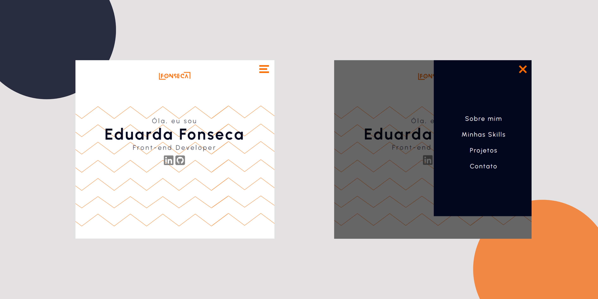

## 💼 Portfólio | Maria Eduarda Fonseca

Este é um projeto de portfólio pessoal desenvolvido com **React**, **TypeScript** e **SCSS**, com o objetivo de apresentar minha trajetória, habilidades e projetos como desenvolvedora Front-end. O site foi pensado para ser moderno, responsivo e acessível, com recursos interativos e design limpo.

### 🔍 Funcionalidades

- 🌗 Alternância entre **modo claro e escuro**.
- 📱 **Layout responsivo**, adaptado para diferentes tamanhos de tela (mobile, tablet e desktop).
- 🔗 Acesso direto ao meu **LinkedIn** e **GitHub**.
- 🗝 Navegação fluida com rolagem suave entre as seções.
- ⬆️ Botão "Voltar ao topo" visível em telas maiores.
- 📄 Exibição de projetos com **links para visualização e código-fonte**.

### 🛠️ Tecnologias utilizadas

- [React](https://reactjs.org/)
- [TypeScript](https://www.typescriptlang.org/)
- [Vite](https://vitejs.dev/)
- [SCSS (Sass)](https://sass-lang.com/)
- [Material UI](https://mui.com/)
- [React Icons](https://react-icons.github.io/react-icons/)

### 🧹 Estrutura do site

- **Header:** Apresentação com nome, cargo e redes sociais.
- **Sobre mim:** Minha história com a tecnologia e transição para o Front-end.
- **Skills:** Principais habilidades técnicas.
- **Projetos:** Galeria com visual moderno, exibindo imagem, descrição e links dos projetos.
- **Contato:** Formas de me contatar diretamente.
- **Footer:** Créditos e assinatura do site.

